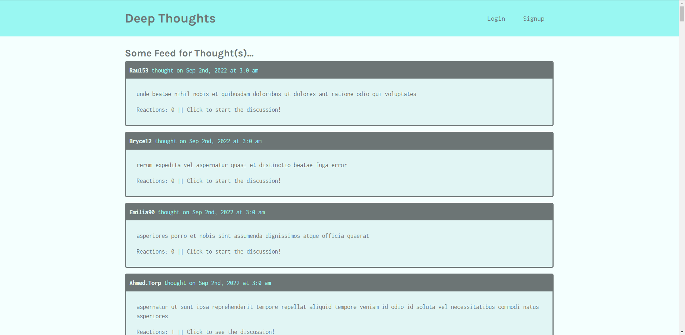

# deep-thoughts

- Github URL: https://github.com/DanielCConlon/deep-thoughts
- Deployed Application: updating heroku deployment
<!-- https://rocky-hollows-78387.herokuapp.com/ -->

# Goal

Make a social media app that allows users to sign up, login, post their thoughts and views, react or reply to a thought, add friends.

## Table-of-Contents

- [Description](#description)
- [Installation](#installation)
- [Usage](#usage)
- [Application](#application)
- [Questions](#questions)

## [Description](#table-of-contents)

Web application that allows users to sign up, login, post their thoughts and views, react or reply to a thought, add friends. This is a MERN application using React, GraphQL, Apollo Server, and MongoDB following steps of a module.

- Learned these skills through this module

- Integrate the Apollo Server GraphQL library to handle data requests.

- Build both query type definitions and resolvers for retrieving data from a MongoDB database.

- Use the Apollo Studio Explorer interface to thoroughly test GraphQL queries.

- Use GraphQL mutations to handle updates to a database.

- Sign and verify JSON Web Tokens as part of the authentication process.

- Use the Apollo Client library to consume GraphQL APIs on the front end.

- Use Routes and Route components to set up client-side routing.

- Implement login functionality and user-based navigation in React.

## [Installation](#table-of-contents)

Download the repo from Github. In the root of the folder run npm i, it will download all the requried dependencies. Run npm run develop to start both development servers at the same time.

## [Usage](#table-of-contents)

- Clone the repo
- Open the command line terminal
- Run npm i
- Run npm run develop

## [Application](#table-of-contents)

## [Questions](#table-of-contents)

To get into contact with me use the follow information below:
 
[Github: DanielCConlon](https://github.com/DanielCConlon)
 
[Email: danielcconlon@gmail.com](danielcconlon@gmail.com)
